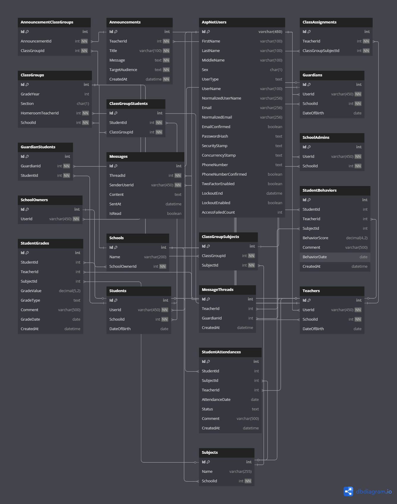

# 🎓 TeachTether Backend API

A backend platform designed for managing school operations, enabling communication between teachers and parents, and tracking student performance.

This system serves as a comprehensive backend infrastructure, seamlessly managing secure access control, real-time communication, and high-complexity relational data processing.

🔗 **Frontend Repository:** [TeachTether Frontend](https://github.com/Hikaaruu/TeachTether.Frontend/)

---

## 🚀 Key Capabilities

- 🔐 JWT-based authentication and authorization using ASP.NET Identity
- 🛂 Fine-grained policy-based access control (custom authorization handlers)
- 💬 Real-time messaging using SignalR (chat system)
- 📈 Student analytics (grades, attendance, behavior tracking)
- 🏫 School structure management 
- 🚨 Global exception handling middleware with strongly-typed, consistent API responses
- ✅ Extensive validation layer using FluentValidation
- 🧪 Comprehensive unit test coverage (services and validators)

---

## 🛠 Tech Stack

**Backend**
* **ASP.NET Core** (.NET 8)
* **Entity Framework Core** (Code-First Migrations)
* **SQL Server**
* **ASP.NET Identity**

**Architecture & Patterns**
* **Clean Architecture**
* **Repository Pattern**
* **Unit of Work**

**Libraries & Tools**
* **SignalR**
* **AutoMapper**
* **FluentValidation**

**Testing**
* **xUnit**
* **Moq**
* **FluentAssertions**

---

## 🧱 Architecture

The project follows a layered architecture:

- **Domain** – Core entities and business rules
- **Application** – Business logic, DTOs, Services, Authorization Handlers
- **Infrastructure** – Data access, Repositories
- **API** – Controllers, SignalR Hubs, Middleware, DI registration

This structure ensures separation of concerns, testability, and scalability.

---

## 🗄️ Database Schema

The relational database schema is designed to efficiently handle the complex school ecosystem, including hierarchical roles, class assignments, analytics tracking, and instant messaging.



## 🧠 Engineering Highlights

- Implemented **policy-based authorization** with custom requirements and handlers for fine-grained access control
- Designed a **rich relational database model** covering complex school domain scenarios
- Built **real-time messaging system** using SignalR for teacher–parent communication
- Applied **Unit of Work + Repository pattern** for controlled data access
- Introduced **centralized exception handling middleware**
- Structured codebase for **high testability**, with extensive unit tests across services and validators

---

## 📊 Domain Coverage

The system models a complete school ecosystem:

- Schools, Admins, Teachers, Students, Guardians
- Class groups, subjects, and teacher assignments  
- Grades, attendance, and behavioral tracking per subject and class context
- Announcements scoped to specific class groups and  audiences
- Messaging system with threads and attachments

---

## ⚙️ Prerequisites

Before running the project, ensure you have:

- [.NET 8 SDK](https://dotnet.microsoft.com/download/dotnet/8.0)
- [SQL Server](https://www.microsoft.com/sql-server/sql-server-downloads)

---

## ⚙️ Getting Started

### 1. Clone the repository

```bash
git clone https://github.com/Hikaaruu/TeachTether.git
cd TeachTether
```

---

### 2. Configure application settings


```json
{
  "ConnectionStrings": {
    "DefaultConnection": "YOUR_SQL_SERVER_CONNECTION"
  },
  "JwtSettings": {
    "Issuer": "TeachTether",
    "Audience": "TeachTether",
    "Key": "YOUR_SECRET_KEY",
    "ExpireHours": "2"
  }
}
```

---

### 3. Apply migrations

```bash
dotnet ef database update --project TeachTether.Infrastructure.Persistence --startup-project TeachTether.API
```

---

### 4. Run the application

```bash
dotnet run --project TeachTether.API
```

---

## 📡 API Overview

The API is organized around a school domain with nested, resource-oriented endpoints:

- 🔐 **Authentication**
  - `/api/Auth/Login`, `/api/Auth/Register`, `/api/Auth/Me`

- 🏫 **Schools & Administration**
  - Manage schools and school administrators
  - `/api/Schools`, `/api/schools/{schoolId}/SchoolAdmins`

- 👨‍🏫 **Teachers, Students & Guardians**
  - Full lifecycle management and relationships
  - `/api/schools/{schoolId}/Teachers`
  - `/api/schools/{schoolId}/Students`
  - `/api/schools/{schoolId}/Guardians`

- 🧩 **Class Structure & Assignments**
  - Class groups, subjects, and teacher assignments
  - `/api/schools/{schoolId}/ClassGroups`
  - `/api/schools/{schoolId}/classgroups/{classGroupId}/subjects`
  - `/api/schools/{schoolId}/classgroups/{classGroupId}/subjects/{subjectId}/ClassAssignments`

- 📊 **Student Records & Analytics**
  - Grades, attendance, behavior tracking, and aggregated analytics
  - `/api/schools/{schoolId}/students/{studentId}/grades`
  - `/api/schools/{schoolId}/students/{studentId}/attendance`
  - `/api/schools/{schoolId}/Analytics/.../averages`

- 📢 **Announcements & Assignments**
  - School-wide and class-level communication
  - `/api/Announcements`
  - `/api/schools/{schoolId}/announcements`

- 💬 **Messaging System**
  - Thread-based communication with attachments
  - `/api/threads`
  - `/api/threads/{threadId}/Messages`
  - `/api/threads/{threadId}/messages/{messageId}/attachments/{id}`

---

## 🧪 Tests

Run tests with:

```bash
dotnet test
```

Includes:

- Service layer tests
- Validation tests

---

## 📌 Highlights

- Complex domain modeling 
- Real-time communication with SignalR
- Fine-grained authorization system
- Clean architecture with strong separation of concerns
- High test coverage across core logic
